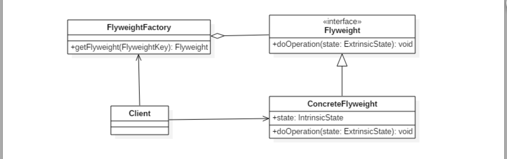

# [DesignPatterns](../../../../../)

## Flyweight(享元)设计模式

### 意图
利用共享的方式来支持大量细粒度的对象，这些对象一部分内部状态是相同的。

### 类图
* Flyweight：享元对象
* IntrinsicState：内部状态，享元对象共享内部状态
* ExtrinsicState：外部状态，每个享元对象的外部状态不同

## 举例：JVM中，字符串常量池就是享元设计模式

