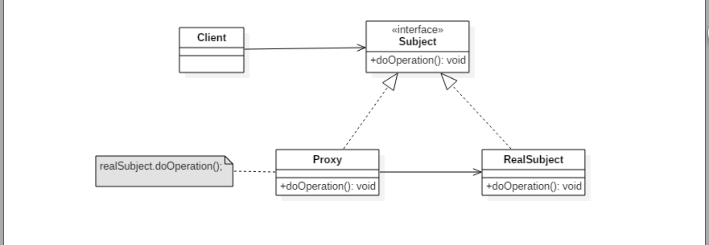

# [DesignPatterns](../../../../..)

## 举例：Java项目开发中，事务，日志都是代理设计模式实现的

## 代理设计模式（静态）

这里我们实现了静态代理模式，静态代理模式必须要实现同一个接口，然后每一个
需要被代理的类都需要实现一个代理类来进行代理这样非常繁琐

## 代理设计模式（JavaProxy实现动态）

动态代理就是在JVM中运行时才确定哪一个对象被哪一个类代理，Java的动态代理
通过反射来实现,有个缺陷，就是必须对实现了一个接口的类进行代理，如果没有
实现接口，则无法代理

## 代理设计模式（Cglib实现动态代理，弥补java中没有接口无法代理的缺陷）

用法相差不大，但是被代理类中必须要有无参构造

